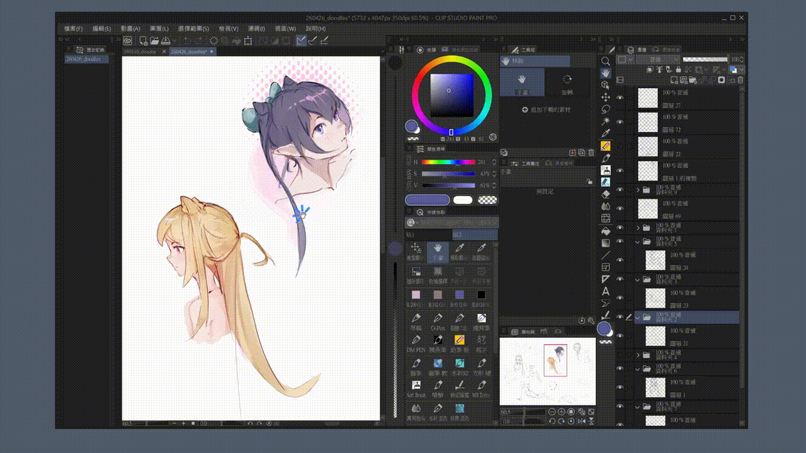

# CSP Grayscale Viewer

<p align="center">
  
  
  
  
</p>

<p align="center">
  <a href="README.md">English</a> |
  <a href="README.zh-TW.md">繁體中文</a> |
  <a href="README.zh-CN.md">简体中文</a> |
  <a href="README.ja-JP.md">日本語</a>
</p>

<p align="center">
  
</p>

CSP Grayscale Viewer 是一款为 Clip Studio Paint 和其他 Windows 绘图软件设计的灰阶预览辅助工具。它会在目标软件上方创建可穿透鼠标与笔输入的灰阶 overlay，让你在不修改作品本身的情况下快速检查明暗关系。

## 为什么使用这种方式

- **不注入 DLL、不 hook、不改内存**：程序不会把代码注入 Clip Studio Paint，也不会 hook 它的渲染流程或修改 CSP 的 process memory。
- **非侵入式设计**：CSP 保持原本的正常渲染，灰阶预览由独立 overlay 窗口负责显示。
- **降低绘图软件崩溃风险**：工具在 CSP 外部运行，不触碰 CSP 内部数据；即使 renderer 出现问题，也不应直接拖垮 CSP。
- **不干扰绘图流程**：overlay 可穿透输入，笔触、鼠标、快捷键和画布操作仍会送到 CSP。
- **绘画时同步预览**：作画过程中即可实时检查明暗，不需要导出图片或复制图层。
- **原生高效率实现**：使用 C++20、Win32、Qt、Windows Magnification 和实验性 D3D11 backend 开发。

## 功能特性

- **目标窗口绑定**：只有在指定的目标应用程序，例如 `CLIPStudioPaint.exe`，获得焦点时才启用灰阶预览。
- **全局快捷键**：可自定义快捷键切换灰阶，默认为 `F9`。
- **Focus-only 快捷键模式**：只有目标软件在前台时才注册快捷键，避免干扰其他应用程序。
- **双 renderer backend**：
  - **Magnification**：基于 Windows Magnification API 的稳定兼容模式。
  - **Experimental Direct3D**：基于 GPU 的实验性 renderer，提供更流畅的预览和未来扩展基础。
- **输入穿透 overlay**：鼠标与绘图笔操作会穿透到下方绘图软件。
- **现代 Qt 托盘程序**：可最小化到系统托盘，在后台安静运行。
- **Log 页面**：可在程序内查看 focus、hotkey 和 renderer 诊断信息。

## 工作原理

程序会追踪当前前台窗口，并将 overlay 对齐到设置好的目标应用程序上方。Magnification 模式使用 Windows Magnification API 和灰阶色彩矩阵。实验性 Direct3D 模式则会捕获桌面输出、裁切目标窗口范围、通过 pixel shader 转换灰阶，最后以 DirectComposition overlay 显示。

## 安装

1. 前往 [Releases](../../releases) 下载最新安装包。
2. 运行 `CSP-Grayscale-Viewer_Setup.exe`。
3. 启动 CSP Grayscale Viewer，设置目标应用程序和快捷键。

## 使用方式

1. 打开 Clip Studio Paint 或其他已设置的绘图软件。
2. 按下快捷键，默认为 `F9`，切换灰阶预览。
3. 从托盘打开设置窗口，可调整刷新率、目标应用程序、快捷键、开机启动和 renderer backend。
4. 如果需要诊断 renderer 或焦点行为，可查看 Log 页面。

## Renderer 说明

想要最高兼容性时，建议使用 **Magnification** 模式。想要更流畅的显示并愿意测试新 backend 时，可使用 **Experimental Direct3D** 模式。

Direct3D backend 仍属于实验性功能。它也是未来加入更多 GPU 效果的基础，例如对比检查、gamma 预览、LUT 和色觉模拟。

## 构建

### 要求

- Windows 10 / 11
- Visual Studio 2022 with MSVC
- CMake 3.20 或以上版本
- Qt 6.9.0 或以上版本
- Inno Setup 6，仅打包安装包时需要

### 命令

```powershell
cmake -S . -B build -G "Visual Studio 17 2022" -A x64 -DCMAKE_PREFIX_PATH="C:/path/to/Qt/6.9.0/msvc2022_64"
cmake --build build --config Release --parallel

New-Item -ItemType Directory -Force deploy
Copy-Item build/Release/CSP-Grayscale-Viewer.exe deploy/
Copy-Item build/Release/CSP-Grayscale-Viewer_Console.exe deploy/
windeployqt --release --no-translations --no-opengl-sw deploy/CSP-Grayscale-Viewer.exe
```

## 许可证

本项目采用 [MIT License](LICENSE) 授权。

Qt 以动态链接方式使用，遵循 LGPL 授权。用户可按需替换安装目录中的 Qt runtime DLL。
